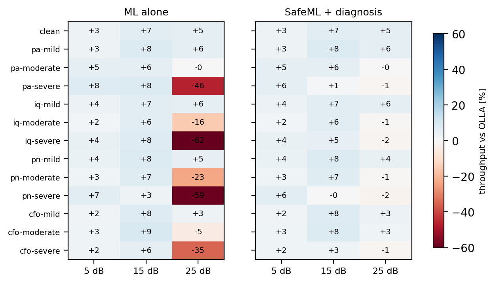

# ML Link Adaptation Under Test: a software call box

When does an ML-based link adaptation model beat the standard approach, when does it fail,
and can a test system detect, diagnose and contain the failure?

This repository simulates the full workflow a call-box team would need for an ML air-interface
feature: **Feature → Test → Diagnose → Mitigate**.
Report (IEEE format): [`report/main.pdf`](report/main.pdf)



*ML throughput relative to a tuned OLLA baseline, per impairment and SNR (averaged over four
3GPP conformance channels). Left: ML alone fails badly at high SNR under moderate/severe
impairments. Right: with a self-check, diagnosis and fallback, the failures are contained and
the gains are kept.*

## Key results

| Experiment | Result |
|---|---|
| E1: ML vs OLLA, clean channels | +2 to +13% in training channels, +9 to +15% on unseen TDLC300-100, −21% on unseen AWGN (over-caution) |
| E2: stress test, 52 scenarios | ML >5% worse than OLLA in 34 of 156 cells, worst −89%, all at high SNR with significant impairments |
| E3: failure detection | Prediction self-check AUROC 0.89 vs input-OOD (Mahalanobis) 0.68 |
| E4: impairment diagnosis | 4-view CNN 59% vs 46% constellation-only; ~95% for moderate/severe at ≥20 dB; correct in all 23 high-SNR failure cells |
| E5: safe fallback | Loss in failure cells −35.8% → −6.9%; gain in good cells +9.0% → +8.1% |

## What is inside

| Folder | Contents |
|---|---|
| `sim/` | NR-like PDSCH chain on [Sionna](https://github.com/NVlabs/sionna) (30 kHz SCS, 24 PRBs, LDPC, DMRS-based LS estimation, MRC); TDL conformance channels; PA (Rapp), IQ imbalance, phase noise, CFO models; BLER tables; fast closed-loop simulator |
| `baseline/` | Outer-loop link adaptation (OLLA) |
| `dut/` | ML model predicting P(ACK) for every MCS from gNB-side features, trained with DAgger |
| `harness/` | Stress test, two failure detectors, diagnosis-aware fallback (SafeML), mock instrument interface |
| `diagnose/` | CNN impairment classifier on four instrument-style views (constellation, AM/AM error, image leakage, phase vs time) |
| `scripts/` | Entry points for every experiment |
| `report/` | LaTeX source and PDF of the write-up |

## Reproduce

```bash
pip install -r requirements.txt
python -m scripts.smoke_test                 # PHY sanity check (~3 min CPU)
python -m dut.train                          # train the ML model (~2 min CPU)
python -m scripts.compare                    # E1 (~4 min CPU)
python -m diagnose.train                     # E4 (~4 min CPU)
python -m scripts.stress_test --snr 5 15 25 --seeds 2 --slots 6000   # E2, E3, E5 (~15 min CPU, resumable)
python -m scripts.paper_figures              # report figures
```

The BLER tables (`results/tables/bler_fits.json`, 52 scenarios) are included. To regenerate
them, run `kaggle_tables.ipynb` on a GPU (about 3.7 h on a Kaggle T4), or
`python -m scripts.make_tables --preset full`.

## Limitations

Simulation only. Impairment models are simplified and not calibrated to specific hardware.
The BLER abstraction conditions on wideband slot SNR and omits HARQ combining. No PTRS, so
phase noise is uncorrected between DMRS symbols. MCS 0–2 are excluded (LDPC rate limit in the
encoder used). One impairment at a time. See the report for details.
